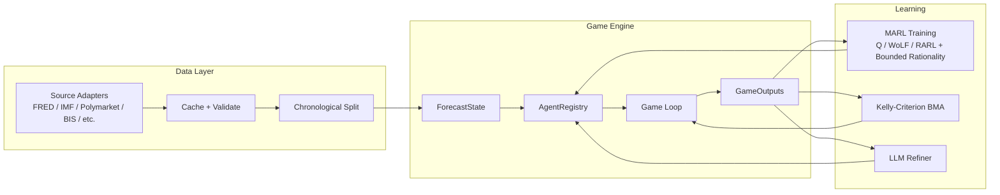

# marl-forecast-game

A multi-agent adversarial forecasting framework that models prediction as a Markov game. Agents -- forecasters, adversaries, and defenders -- interact across rounds to produce resilient, probabilistic forecasts under uncertainty. The system supports hierarchical agent topologies, Bayesian Model Averaging, multi-agent reinforcement learning, and real macroeconomic data integration via the FRED API.

## Key Capabilities

**Multi-Agent Game Engine**
- Immutable simulation state via frozen dataclasses with pure-functional transitions
- 8 agent types: forecaster, adversary, wolfpack adversary, defender, refactorer, bottom-up, top-down, ensemble aggregator
- Flexible `AgentRegistry` supporting variable agent counts and hierarchical composition
- Pluggable strategy runtimes (Python, Haskell subprocess, LLM-backed)

**Adversarial Robustness**
- 10 disturbance models: Gaussian, shift, evasion, volatility-scaled, regime shift, volatility burst, drift, historical, escalating, wolfpack
- 5 defense models: dampening, clipping, bias guard, ensemble, stacked composition
- Coordinated "Wolfpack" adversary targeting correlated forecaster clusters
- Clean vs. attacked comparison with robustness delta/ratio metrics

**Probabilistic Forecasting**
- Kelly-Criterion Bayesian Model Averaging with exponential bankroll weight updates
- Agent bankruptcy detection and dynamic pruning
- Distributional outputs: mean, variance, quantile fan (p10/p25/p50/p75/p90)
- Calibration metrics: PIT, CRPS, negative CRPS, interval coverage

**MARL Training**
- Tabular Q-learning with epsilon-greedy and Boltzmann (softmax) action selection
- WoLF-PHC (Win or Learn Fast - Policy Hill Climbing) for equilibrium-seeking
- Robust Adversarial RL (RARL) with bounded rationality curriculum and alternating training epochs
- Temperature-scheduled adversary: decays from exploratory to exploitative across RARL epochs
- Q-table serialization for persistence and reproducibility

**Data Integration**
- 12 source adapters: FRED, IMF, Polymarket, GPR, OECD CLI, BIS, BEA, Eurostat, Kalshi, PredictIt, World Bank, Kaggle
- Multi-series FRED download (CPI, GDP, unemployment, fed funds, breakeven inflation) via `FRED_API_KEY`
- Caching with checksum integrity, freshness checks, and force-redownload
- Poisoning detection via z-score and modified z-score (MAD)
- Chronological splitting with leakage prevention

**Validation and Deployment**
- 24-scenario validation framework with JSON/CSV reporting
- 9 automated verification checks including 100-run determinism and 10k-round stress
- 21 Hypothesis property-based tests for core invariants
- Walk-forward backtesting and per-factor sensitivity analysis
- Monte Carlo scenario generation with percentile trajectory fans
- Docker containerization with healthcheck and CI/CD via GitHub Actions
- Distributed parallel execution via multiprocessing

## Architecture Overview

The system is structured as a Markov game where agents interact through a shared immutable state. See [docs/architecture.md](docs/architecture.md) for full details.



## Quickstart

```bash
python -m venv .venv
source .venv/bin/activate
pip install -r requirements.txt

# Run tests
pytest

# Run verification (9 checks)
python scripts/run_verification.py

# Run all 24 validation scenarios
python scripts/run_validation_scenarios.py --scenarios all
```

## FRED Data Integration

Set `FRED_API_KEY` to enable real macroeconomic data as a training source. The adapter downloads five series -- CPI (`CPIAUCSL`), GDP, unemployment rate (`UNRATE`), federal funds rate (`FEDFUNDS`), and 10-year breakeven inflation (`T10YIE`) -- and merges them into time-aligned training rows with a `macro_context` dict per record.

```bash
export FRED_API_KEY=your_key_here
python scripts/run_training.py          # trains on real FRED data
python scripts/run_backtest.py          # backtests on FRED history
```

Without the key, all FRED-dependent features fall back gracefully to synthetic proxies. See [docs/data-pipeline.md](docs/data-pipeline.md) for the full data architecture.

## MARL Training

Train learnable agents using Q-learning, WoLF-PHC, or robust adversarial RL:

```bash
# WoLF-PHC (default)
python scripts/run_training.py --algorithm wolf --episodes 200

# Tabular Q-learning
python scripts/run_training.py --algorithm q --episodes 300

# Robust Adversarial RL (alternating forecaster/adversary epochs)
python scripts/run_training.py --algorithm rarl --episodes 100
```

Q-tables are serialized to `data/models/`. See [docs/training.md](docs/training.md) for algorithm details.

## Walk-Forward Backtesting

Run walk-forward validation with configurable sliding windows:

```bash
python scripts/run_backtest.py --windows 10 --window-size 60 --step-size 20
```

Reports are written to `planning/backtest_report.json`. See [docs/bayesian-aggregation.md](docs/bayesian-aggregation.md) for backtesting methodology and probabilistic metrics.

## Validation

The framework includes three layers of validation:

| Layer | Count | Command |
|---|---|---|
| Unit + integration tests | 70 | `pytest tests/test_framework.py` |
| Hypothesis property tests | 21 | `pytest tests/test_properties.py` |
| Validation scenarios | 24 | `python scripts/run_validation_scenarios.py --scenarios all` |
| Verification checks | 9 | `python scripts/run_verification.py` |

List available scenarios:

```bash
python scripts/run_validation_scenarios.py --list
```

See [docs/validation.md](docs/validation.md) for the full scenario catalog and verification check details.

## Docker

```bash
# Fast path: build and run default validation
docker build -t marl-forecast-game:test .
docker run --rm marl-forecast-game:test

# Full container test harness (pytest + verification + 22 scenarios)
bash scripts/run_container_test_harness.sh
```

The image includes a healthcheck that runs core verification checks. See [docs/deployment.md](docs/deployment.md) for full container and CI documentation.

## Project Structure

```
marl-forecast-game/
├── framework/                     # Core library
│   ├── types.py                   #   Frozen dataclasses: ForecastState, SimulationConfig, etc.
│   ├── agents.py                  #   8 agent types + AgentRegistry + SafeAgentExecutor
│   ├── game.py                    #   ForecastGame engine and GameOutputs
│   ├── aggregation.py             #   BayesianAggregator with Kelly-Criterion BMA
│   ├── training.py                #   Q-learning, WoLF-PHC, RARL, TrainingLoop
│   ├── backtesting.py             #   WalkForwardBacktester, SensitivityAnalyzer
│   ├── scenarios.py               #   Monte Carlo ScenarioGenerator
│   ├── distributed.py             #   ParallelGameRunner (multiprocessing)
│   ├── hyperopt.py                #   BayesianOptimizer for config tuning
│   ├── metrics.py                 #   MAE, RMSE, MAPE, PIT, CRPS, neg_crps, interval coverage
│   ├── disturbances.py            #   10 disturbance models + factory
│   ├── defenses.py                #   5 defense models + stacked combinator + factory
│   ├── strategy_runtime.py        #   Runtime backends: Python, Haskell, Prompt, ModelBackend
│   ├── data.py                    #   Dataset loading, splitting, poisoning detection
│   ├── data_utils.py              #   Caching, integrity validation, FredTrainingDataBuilder
│   ├── observability.py           #   structlog + Prometheus instrumentation
│   ├── verify.py                  #   9-check verification suite
│   ├── validation_scenarios.py    #   24-scenario validation framework
│   ├── data_sources/              #   Source adapter subpackage
│   │   ├── base.py                #     NormalizedRecord + SourceAdapter protocol
│   │   ├── macro_fred.py          #     FRED adapter (single + multi-series)
│   │   ├── macro_imf.py           #     IMF World Economic Outlook adapter
│   │   ├── prediction_polymarket.py #   Polymarket prediction market adapter
│   │   ├── geopolitical_risk.py   #     GPR index adapter (synthetic proxy)
│   │   ├── oecd_cli.py            #     OECD CLI adapter (synthetic proxy)
│   │   └── bis_policy_rate.py     #     BIS policy rate adapter (synthetic proxy)
│   └── llm/                       #   LLM integration subpackage
│       ├── base.py                #     RefactorRequest/Suggestion protocols
│       ├── mock.py                #     MockLLMRefactorClient
│       ├── ollama.py              #     OllamaClient, DSPyLikeRepl, OllamaRefactorClient
│       ├── ollama_interface.py    #     Full Ollama REST API wrapper
│       └── refiner.py             #     RecursiveStrategyRefiner
├── scripts/                       # CLI entry points
│   ├── run_training.py            #   MARL training (Q / WoLF / RARL)
│   ├── run_backtest.py            #   Walk-forward backtesting
│   ├── run_verification.py        #   9-check verification
│   ├── run_validation_scenarios.py #  24-scenario validation
│   ├── run_test_suite.py          #   Extended test suite with reporting
│   ├── run_container_test_harness.sh # Docker build + full test pipeline
│   └── validate.sh                #   Minimal entrypoint (pytest + verify)
├── tests/                         # Test suite
│   ├── test_framework.py          #   70 unit/integration tests
│   └── test_properties.py         #   21 Hypothesis property-based tests
├── haskell/                       # Haskell migration scaffold
│   ├── src/Types.hs               #   ForecastState ADT
│   ├── src/Game.hs                #   Pure evolveState transition
│   └── test/Main.hs               #   QuickCheck determinism property
├── data/                          # Data artifacts
│   ├── cache/                     #   Cached API responses (FRED, IMF, Polymarket)
│   ├── models/                    #   Serialized Q-tables
│   └── sample_demand.csv          #   Generated synthetic dataset
├── planning/                      # Planning documents and reports
│   ├── TODO_001.md ... TODO_008.md #  Implementation backlog
│   ├── IMPLEMENTATION_REPORT.md   #   Status report
│   └── *.json / *.csv             #   Validation and backtest reports
├── docs/                          # Detailed documentation
├── PRD.md                         # Product requirements document
├── DRD.md                         # Data requirements document
├── Dockerfile                     # Container build
└── requirements.txt               # Python dependencies
```

## Configuration Reference

`SimulationConfig` controls the game engine. All fields have sensible defaults:

| Field | Type | Default | Description |
|---|---|---|---|
| `horizon` | int | 100 | Target number of rounds |
| `max_rounds` | int | 200 | Hard cap on rounds |
| `max_round_timeout_s` | float | 1.0 | Per-round wall-clock timeout |
| `base_noise_std` | float | 0.15 | Gaussian noise standard deviation |
| `disturbance_prob` | float | 0.1 | Probability of disturbance per round |
| `disturbance_scale` | float | 1.0 | Disturbance amplitude multiplier |
| `adversarial_intensity` | float | 1.0 | Adversary aggressiveness scale |
| `runtime_backend` | str | `"python"` | `python`, `haskell`, or `prompt` |
| `disturbance_model` | str | `"gaussian"` | Disturbance model name |
| `defense_model` | str | `"dampening"` | Defense model name |
| `enable_refactor` | bool | True | Enable refactoring agent |
| `enable_llm_refactor` | bool | False | Use LLM for refactoring |
| `attack_cost` | float | 0.0 | Cost penalty for adversary |
| `convergence_threshold` | float | 0.0 | Rolling MAE threshold for early stop |
| `adversary_tau_init` | float | 5.0 | Initial Boltzmann temperature (RARL bounded rationality) |
| `adversary_tau_final` | float | 0.1 | Terminal Boltzmann temperature |
| `tau_decay_rate` | float | 0.05 | Exponential decay rate for tau schedule |
| `bankruptcy_threshold` | float | 0.01 | Kelly bankroll floor for agent pruning |
| `wolfpack_correlation_threshold` | float | 0.7 | Pearson rho cutoff for wolfpack coalition |

See [docs/configuration.md](docs/configuration.md) for `DataProfile`, runtime backends, and model name registries.

## Data Ethics and Compliance

- The framework only reads public APIs/sources listed in `DRD.md`.
- Source records retain provenance (`source`, `fetched_at`) for auditability.
- Ingestion includes outlier-based poisoning screening via `detect_poisoning_rows`.
- Chronological splitting is enforced to prevent future data leakage.
- API clients fail closed to synthetic proxies when endpoints are unreachable or credentials are unavailable.

## Further Reading

| Document | Description |
|---|---|
| [docs/architecture.md](docs/architecture.md) | System design, Markov game formulation, pure-functional principles |
| [docs/agents.md](docs/agents.md) | All 8 agent types, registry pattern, wolfpack adversary, ensemble aggregation |
| [docs/data-pipeline.md](docs/data-pipeline.md) | Source adapters, FRED integration, caching, poisoning detection |
| [docs/training.md](docs/training.md) | Q-learning, WoLF-PHC, RARL with bounded rationality curriculum |
| [docs/bayesian-aggregation.md](docs/bayesian-aggregation.md) | Kelly-Criterion BMA, bankruptcy pruning, probabilistic forecasts, backtesting |
| [docs/disturbances-and-defenses.md](docs/disturbances-and-defenses.md) | 10 disturbance and 5 defense models |
| [docs/validation.md](docs/validation.md) | 24 scenarios, 9 checks, property tests |
| [docs/llm-integration.md](docs/llm-integration.md) | Ollama, DSPyLikeRepl, recursive strategy refinement |
| [docs/configuration.md](docs/configuration.md) | SimulationConfig, DataProfile, model registries |
| [docs/deployment.md](docs/deployment.md) | Docker, CI/CD, container harness, distributed execution |
| [docs/haskell-migration.md](docs/haskell-migration.md) | Haskell scaffold, subprocess bridge, QuickCheck parity |
| [PRD.md](PRD.md) | Product requirements document |
| [DRD.md](DRD.md) | Data requirements document |
