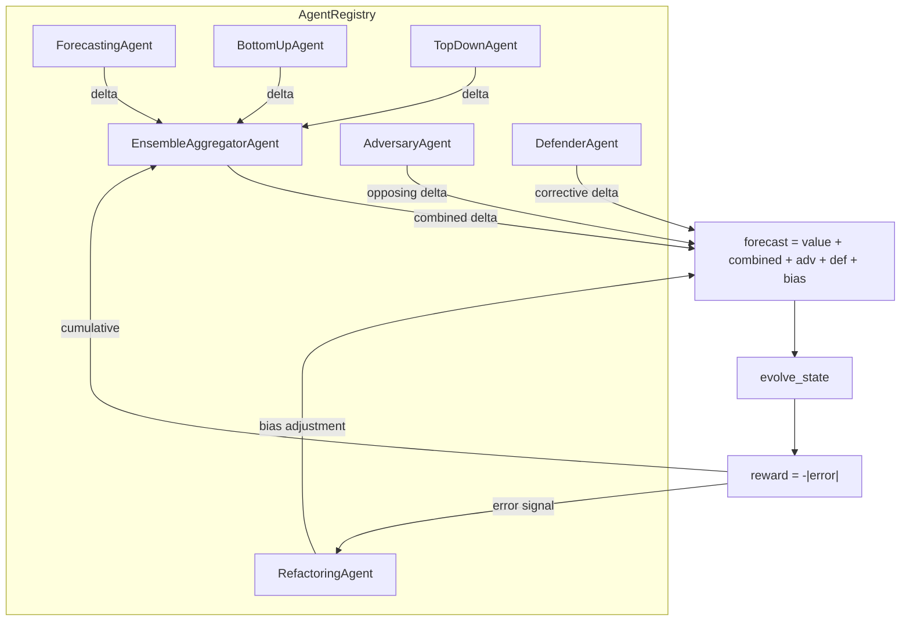

# Agents

## Overview

The framework provides 7 agent types that interact through the game loop. Each agent produces an `AgentAction(actor, delta)` that contributes to the round's forecast. Agents are composed into an `AgentRegistry` that supports variable agent counts and hierarchical topologies.

## Agent Types

| Agent | Class | Role | Input | Signature |
|---|---|---|---|---|
| Forecaster | `ForecastingAgent` | Base prediction | State + runtime | `act(state, runtime) -> AgentAction` |
| Bottom-Up | `BottomUpAgent` | Segment-level prediction | State + runtime | `act(state, runtime) -> AgentAction` |
| Top-Down | `TopDownAgent` | Macro-level adjustment | State only | `act(state) -> AgentAction` |
| Adversary | `AdversaryAgent` | Inject adversarial delta | State | `act(state) -> AgentAction` |
| Defender | `DefenderAgent` | Corrective delta | Forecast + adversary action | `act(forecast_action, adversary_action, defense_model) -> AgentAction` |
| Refactorer | `RefactoringAgent` | Bias correction | Error signal | `revise(latest_error, use_llm) -> float` |
| Aggregator | `EnsembleAggregatorAgent` | Combine forecaster deltas | List of actions | `aggregate(actions, reward_history) -> AgentAction` |

## ForecastingAgent

The default forecaster delegates prediction to the `StrategyRuntime`:

```python
base_delta = runtime.forecast_delta(state)  # 0.4 + 0.4 * exogenous
```

When an `llm_repl` (a `DSPyLikeRepl` instance) is provided, the agent blends the runtime delta with an LLM-suggested delta at an 80/20 ratio, falling back to the runtime delta on any error.

## BottomUpAgent

Operates on granular segment data. Computes a weighted blend of the runtime delta and the mean of `state.segment_values`:

```python
delta = (1.0 - segment_weight) * runtime_delta + segment_weight * mean(segment_values)
```

The `segment_weight` parameter (default 0.3) controls the influence of segment-level data versus the base forecast.

## TopDownAgent

Uses aggregate macroeconomic context to produce a directional adjustment. Computes the mean of all `macro_context` values and scales by `macro_sensitivity` (default 0.2):

```python
delta = macro_sensitivity * mean(macro_context.values())
```

This agent does not use the `StrategyRuntime` and takes only the `ForecastState` as input.

## AdversaryAgent

Opposes the expected trend to maximize forecast error:

```python
expected_trend = 0.4 + 0.4 * exogenous
direction = -1.0 if expected_trend >= 0 else 1.0
base = direction * 0.4 * aggressiveness
```

An `attack_cost` penalty reduces the adversary's effective delta, modeling the cost of adversarial action.

## DefenderAgent

Applies a defense model to produce a corrective delta that counteracts the adversary:

```python
defense = defense_from_name(defense_model)
correction = defense.defend(forecast_delta, adversary_delta)
```

See [disturbances-and-defenses.md](disturbances-and-defenses.md) for available defense models.

## RefactoringAgent

Provides inter-round bias correction based on cumulative error:

- **Mock mode** (default): applies a fixed `step_size` (0.02) correction in the direction opposite to the error.
- **LLM mode** (`use_llm=True`): delegates to an `LLMRefactorClient` (either `OllamaRefactorClient` or `MockLLMRefactorClient`) to get a `bias_adjustment` and rationale.

The bias accumulates across rounds, continuously adjusting the forecast.

## EnsembleAggregatorAgent

Combines multiple forecaster deltas into a single composite delta.

### Modes

| Mode | Behavior |
|---|---|
| `equal` (default) | Arithmetic mean of all deltas: `sum(deltas) / count` |
| `reward_proportional` | Weights proportional to `max(0, cumulative_reward + 1)` per agent |

The `reward_proportional` mode requires a `reward_history` dict mapping agent names to cumulative rewards. Agents with higher historical performance receive more weight.

## AgentRegistry

A frozen dataclass that holds collections of agents:

```python
@dataclass(frozen=True)
class AgentRegistry:
    forecasters: tuple[ForecastingAgent | BottomUpAgent, ...] = ()
    adversaries: tuple[AdversaryAgent, ...] = ()
    defenders: tuple[DefenderAgent, ...] = ()
    refactorer: RefactoringAgent | None = None
    aggregator: EnsembleAggregatorAgent = EnsembleAggregatorAgent()
```

The `forecasters` tuple can contain any mix of `ForecastingAgent`, `BottomUpAgent`, and `TopDownAgent` instances. During the game loop, the engine iterates over all forecasters and aggregates their outputs.

### Constructing a Custom Registry

```python
from framework.agents import (
    AgentRegistry, ForecastingAgent, BottomUpAgent, TopDownAgent,
    AdversaryAgent, DefenderAgent, RefactoringAgent, EnsembleAggregatorAgent,
)
from framework.game import ForecastGame
from framework.types import SimulationConfig, ForecastState

registry = AgentRegistry(
    forecasters=(ForecastingAgent(), BottomUpAgent(segment_weight=0.4), TopDownAgent()),
    adversaries=(AdversaryAgent(aggressiveness=1.5),),
    defenders=(DefenderAgent(),),
    refactorer=RefactoringAgent(),
    aggregator=EnsembleAggregatorAgent(mode="reward_proportional"),
)

game = ForecastGame(SimulationConfig(), seed=42, registry=registry)
init = ForecastState(t=0, value=10.0, exogenous=0.0, hidden_shift=0.0)
outputs = game.run(init, disturbed=True)
```

### Legacy Factory Interface

For backward compatibility, `ForecastGame` also accepts an `agent_factory` callable that returns the legacy 4-tuple `(ForecastingAgent, AdversaryAgent, DefenderAgent, RefactoringAgent)`. This is internally converted into an `AgentRegistry` via `_build_registry()`.

## SafeAgentExecutor

Wraps agent calls with exception handling:

```python
@dataclass(frozen=True)
class SafeAgentExecutor:
    fallback_delta: float = 0.0

    def execute(self, fn, *args, **kwargs) -> AgentAction:
        try:
            return fn(*args, **kwargs)
        except Exception:
            return AgentAction(actor="fallback", delta=self.fallback_delta)
```

Every agent call in the game loop goes through `SafeAgentExecutor.execute()`. If an agent raises any exception, the executor returns a zero-delta fallback action and logs a warning. This prevents a single agent failure from crashing the entire simulation.

## Agent Interaction Diagram


