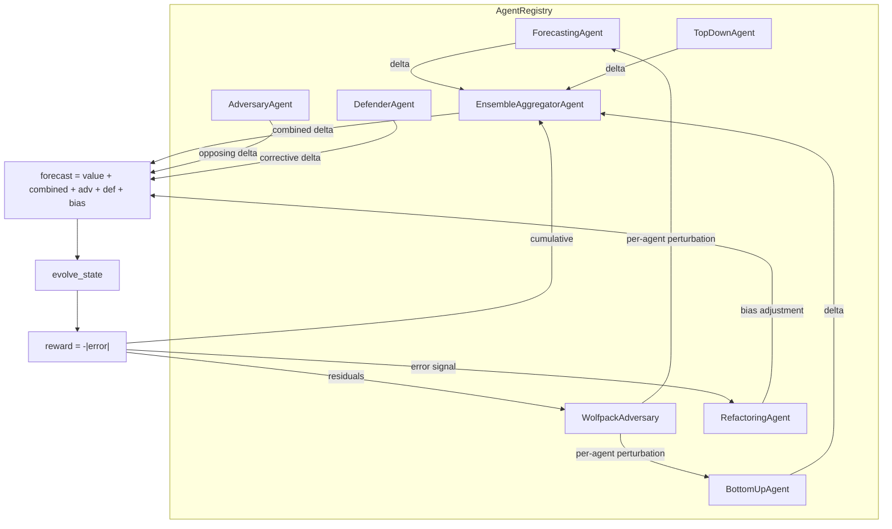

# Agents

## Overview

The framework provides 8 agent types that interact through the game loop. Each agent produces an `AgentAction(actor, delta)` that contributes to the round's forecast. Agents are composed into an `AgentRegistry` that supports variable agent counts and hierarchical topologies.

## Agent Types

| Agent | Class | Role | Input | Signature |
|---|---|---|---|---|
| Forecaster | `ForecastingAgent` | Base prediction | State + runtime | `act(state, runtime) -> AgentAction` |
| Bottom-Up | `BottomUpAgent` | Segment-level prediction | State + runtime | `act(state, runtime) -> AgentAction` |
| Top-Down | `TopDownAgent` | Macro-level adjustment | State only | `act(state) -> AgentAction` |
| Adversary | `AdversaryAgent` | Inject adversarial delta | State | `act(state) -> AgentAction` |
| Wolfpack | `WolfpackAdversary` | Coordinated multi-target attack | State + residual history | `act(state, is_primary) -> AgentAction` |
| Defender | `DefenderAgent` | Corrective delta | Forecast + adversary action | `act(forecast_action, adversary_action, defense_model) -> AgentAction` |
| Refactorer | `RefactoringAgent` | Bias correction | Error signal | `revise(latest_error, use_llm) -> float` |
| Aggregator | `EnsembleAggregatorAgent` | Combine forecaster deltas | List of actions | `aggregate(actions, reward_history) -> AgentAction` |

## ForecastingAgent

The default forecaster delegates prediction to the `StrategyRuntime`:

```python
base_delta = runtime.forecast_delta(state)  # 0.4 + 0.4 * exogenous
```

When an `llm_repl` (a `DSPyLikeRepl` instance) is provided, the agent blends the runtime delta with an LLM-suggested delta at an 80/20 ratio, falling back to the runtime delta on any error.

## BottomUpAgent

Operates on granular segment data. Computes a weighted blend of the runtime delta and the mean of `state.segment_values`:

```python
delta = (1.0 - segment_weight) * runtime_delta + segment_weight * mean(segment_values)
```

The `segment_weight` parameter (default 0.3) controls the influence of segment-level data versus the base forecast.

## TopDownAgent

Uses aggregate macroeconomic context to produce a directional adjustment. Computes the mean of all `macro_context` values and scales by `macro_sensitivity` (default 0.2):

```python
delta = macro_sensitivity * mean(macro_context.values())
```

This agent does not use the `StrategyRuntime` and takes only the `ForecastState` as input.

## AdversaryAgent

Opposes the expected trend to maximize forecast error:

```python
expected_trend = 0.4 + 0.4 * exogenous
direction = -1.0 if expected_trend >= 0 else 1.0
base = direction * 0.4 * aggressiveness
```

An `attack_cost` penalty reduces the adversary's effective delta, modeling the cost of adversarial action.

## WolfpackAdversary

A coordinated adversary that targets correlated forecaster clusters rather than attacking randomly. Based on the Wolfpack Adversarial Attack methodology (arXiv:2502.02844).

Unlike `AdversaryAgent` (frozen dataclass), `WolfpackAdversary` is a mutable dataclass because it maintains historical residual data across rounds.

### Parameters

| Parameter | Default | Description |
|---|---|---|
| `aggressiveness` | 1.0 | Attack strength multiplier |
| `attack_cost` | 0.0 | Cost penalty for adversarial action |
| `correlation_threshold` | 0.7 | Pearson rho cutoff for coalition membership |

### Targeting Mechanism

1. **Residual tracking**: Each round, the wolfpack records per-agent forecast residuals via `record_residual(agent_name, residual)`.
2. **Correlation matrix**: Computes pairwise Pearson correlation coefficients across agents' residual histories.
3. **Coalition selection**: Given a primary target (the forecaster with the highest BMA weight), agents with `|rho| >= correlation_threshold` form the coalition.
4. **Differentiated attack**: The primary target receives full-strength perturbation; coalition members receive half-strength perturbation.

### Usage

```python
from framework.agents import WolfpackAdversary

wolf = WolfpackAdversary(aggressiveness=1.5, correlation_threshold=0.7)

# Record residuals each round
wolf.record_residual("agent_a", 0.05)
wolf.record_residual("agent_b", 0.04)
wolf.record_residual("agent_c", -0.3)

# Compute targets
primary, coalition = wolf.select_targets("agent_a")
# coalition contains agents correlated with agent_a above threshold

# Generate attack action
action = wolf.act(state, is_primary=True)   # full aggressiveness
action = wolf.act(state, is_primary=False)  # half aggressiveness for coalition
```

### Game Loop Integration

When a `WolfpackAdversary` is in the `AgentRegistry`, the game loop:

1. Identifies the primary target from the `BayesianAggregator` weights (highest-weight agent).
2. Selects the coalition via `select_targets()`.
3. Perturbs each targeted forecaster's individual delta **before** aggregation.
4. Non-targeted forecasters are unaffected.

This models a coordinated attack that exploits ensemble correlation structure.

## DefenderAgent

Applies a defense model to produce a corrective delta that counteracts the adversary:

```python
defense = defense_from_name(defense_model)
correction = defense.defend(forecast_delta, adversary_delta)
```

See [disturbances-and-defenses.md](disturbances-and-defenses.md) for available defense models.

## RefactoringAgent

Provides inter-round bias correction based on cumulative error:

- **Mock mode** (default): applies a fixed `step_size` (0.02) correction in the direction opposite to the error.
- **LLM mode** (`use_llm=True`): delegates to an `LLMRefactorClient` (either `OllamaRefactorClient` or `MockLLMRefactorClient`) to get a `bias_adjustment` and rationale.

The bias accumulates across rounds, continuously adjusting the forecast.

## EnsembleAggregatorAgent

Combines multiple forecaster deltas into a single composite delta.

### Modes

| Mode | Behavior |
|---|---|
| `equal` (default) | Arithmetic mean of all deltas: `sum(deltas) / count` |
| `reward_proportional` | Weights proportional to `max(0, cumulative_reward + 1)` per agent |

The `reward_proportional` mode requires a `reward_history` dict mapping agent names to cumulative rewards. Agents with higher historical performance receive more weight.

## AgentRegistry

A frozen dataclass that holds collections of agents:

```python
@dataclass(frozen=True)
class AgentRegistry:
    forecasters: tuple[ForecastingAgent | BottomUpAgent, ...] = ()
    adversaries: tuple[AdversaryAgent | WolfpackAdversary, ...] = ()
    defenders: tuple[DefenderAgent, ...] = ()
    refactorer: RefactoringAgent | None = None
    aggregator: EnsembleAggregatorAgent = EnsembleAggregatorAgent()
```

The `forecasters` tuple can contain any mix of `ForecastingAgent`, `BottomUpAgent`, and `TopDownAgent` instances. The `adversaries` tuple accepts both standard `AdversaryAgent` and `WolfpackAdversary` instances. During the game loop, the engine iterates over all forecasters and aggregates their outputs.

### Constructing a Custom Registry

```python
from framework.agents import (
    AgentRegistry, ForecastingAgent, BottomUpAgent, TopDownAgent,
    AdversaryAgent, DefenderAgent, RefactoringAgent, EnsembleAggregatorAgent,
)
from framework.game import ForecastGame
from framework.types import SimulationConfig, ForecastState

registry = AgentRegistry(
    forecasters=(ForecastingAgent(), BottomUpAgent(segment_weight=0.4), TopDownAgent()),
    adversaries=(AdversaryAgent(aggressiveness=1.5),),
    defenders=(DefenderAgent(),),
    refactorer=RefactoringAgent(),
    aggregator=EnsembleAggregatorAgent(mode="reward_proportional"),
)

game = ForecastGame(SimulationConfig(), seed=42, registry=registry)
init = ForecastState(t=0, value=10.0, exogenous=0.0, hidden_shift=0.0)
outputs = game.run(init, disturbed=True)
```

### Legacy Factory Interface

For backward compatibility, `ForecastGame` also accepts an `agent_factory` callable that returns the legacy 4-tuple `(ForecastingAgent, AdversaryAgent, DefenderAgent, RefactoringAgent)`. This is internally converted into an `AgentRegistry` via `_build_registry()`.

## SafeAgentExecutor

Wraps agent calls with exception handling:

```python
@dataclass(frozen=True)
class SafeAgentExecutor:
    fallback_delta: float = 0.0

    def execute(self, fn, *args, **kwargs) -> AgentAction:
        try:
            return fn(*args, **kwargs)
        except Exception:
            return AgentAction(actor="fallback", delta=self.fallback_delta)
```

Every agent call in the game loop goes through `SafeAgentExecutor.execute()`. If an agent raises any exception, the executor returns a zero-delta fallback action and logs a warning. This prevents a single agent failure from crashing the entire simulation.

## Agent Interaction Diagram


```mermaid
graph TB
    subgraph registry ["AgentRegistry"]
        F1["ForecastingAgent"]
        F2["BottomUpAgent"]
        F3["TopDownAgent"]
        Agg["EnsembleAggregatorAgent"]
        Adv["AdversaryAgent"]
        Wolf["WolfpackAdversary"]
        Def["DefenderAgent"]
        Ref["RefactoringAgent"]
    end

    F1 -->|delta| Agg
    F2 -->|delta| Agg
    F3 -->|delta| Agg
    Wolf -->|"per-agent perturbation"| F1
    Wolf -->|"per-agent perturbation"| F2
    Agg -->|combined delta| Forecast["forecast = value + combined + adv + def + bias"]
    Adv -->|opposing delta| Forecast
    Def -->|corrective delta| Forecast
    Ref -->|bias adjustment| Forecast
    Forecast --> Evolve["evolve_state"]
    Evolve --> Reward["reward = -|error|"]
    Reward -->|cumulative| Agg
    Reward -->|error signal| Ref
    Reward -->|residuals| Wolf
```

## Ray Actor Agents

For distributed training and stateful agent representations, the framework provides Ray actor wrappers in `framework/ray_actors.py`. These are `@ray.remote` classes that maintain persistent state across rounds and can be distributed across cluster nodes.

### Actor Types

| Actor | Wraps | Persistent State |
|---|---|---|
| `RayForecasterActor` | `ForecastingAgent` | Cumulative reward, Q-table weights |
| `RayAdversaryActor` | `AdversaryAgent` | Cumulative reward, attack history |
| `RayDefenderActor` | `DefenderAgent` | Cumulative reward |

Each actor exposes:
- `act.remote(state_dict) -> dict` -- produces an action from a serialized state
- `update_reward.remote(reward) -> None` -- accumulates reward feedback
- `get_reward.remote() -> float` -- returns cumulative reward

### ActorRegistry

`ActorRegistry` holds Ray actor handles instead of direct agent instances:

```python
from framework.ray_actors import RayForecasterActor, ActorRegistry

forecaster = RayForecasterActor.remote(name="f1", runtime_backend="python")
registry = ActorRegistry(forecasters=[forecaster])
```

### When to Use Actor-Based Agents

| Scenario | Recommended |
|---|---|
| Single-machine simulation | In-process `AgentRegistry` |
| Distributed MARL training | `ActorRegistry` with Ray actors |
| Stateful agents with learned parameters | Ray actors (persistent memory across episodes) |
| Monte Carlo evaluation sweeps | `RayParallelGameRunner` with in-process agents |

## RLlib Environment Wrappers

`framework/rllib_env.py` provides Gymnasium-compatible environment wrappers for RL training:

- **`ForecastGameEnv`**: Single-agent environment where the agent controls the forecaster delta. Adversary and defender use fixed heuristic policies.
- **`ForecastGameMultiAgentEnv`**: Multi-agent environment with agent IDs `"forecaster"`, `"adversary"`, `"defender"`. Each agent provides a scalar delta simultaneously.

Both environments expose a 4-dimensional observation space `[t, value, exogenous, hidden_shift]` and a 1-dimensional continuous action space `[-5, 5]`.
