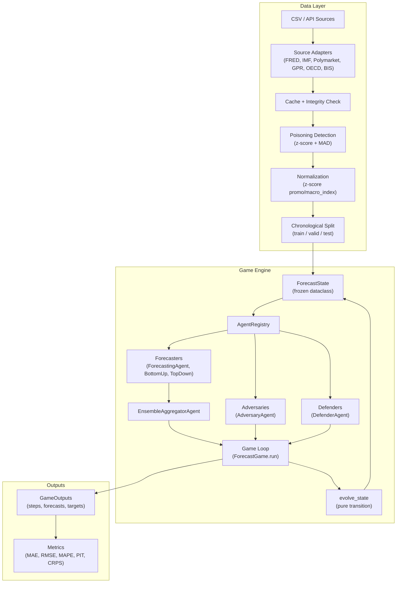

# Architecture

## Overview

The system models time-series forecasting as a multi-agent Markov game. At each round, a set of agents -- forecasters, adversaries, and defenders -- observe an immutable state, produce actions, and receive rewards. A pure transition function evolves the state deterministically given noise and disturbance inputs. This architecture enforces reproducibility by construction: identical seeds produce identical trajectories.

## Markov Game Formulation

The game is defined by the tuple **(S, A, T, R)**:

- **S** (`ForecastState`): the state space, represented as a frozen dataclass with fields `t`, `value`, `exogenous`, `hidden_shift`, `segment_id`, `segment_values`, and `macro_context`.
- **A** (`AgentAction`): the action space, where each agent produces a scalar `delta` applied to the forecast.
- **T** (`evolve_state`): the transition function, a pure function computing the next state from the current state, trend, noise, and disturbance.
- **R**: the reward function, where forecasters receive `-|error|` and adversaries receive `+|error|`.

## System Diagram



## Pure-Functional Design

The framework enforces determinism through several mechanisms:

### Frozen Dataclasses

All state types are `@dataclass(frozen=True)`, making them immutable after construction. `ForecastState`, `SimulationConfig`, `AgentAction`, `StepResult`, and `TrajectoryEntry` cannot be mutated in place. State transitions create new instances via `dataclasses.replace()`.

### `evolve_state` Transition Function

The core transition is a pure function with explicit inputs:

```python
def evolve_state(
    state: ForecastState,
    *,
    base_trend: float,
    noise: float,
    disturbance: float,
    coeff_map: dict[str, float] | None = None,
) -> ForecastState:
```

The function computes:

```
new_value = value + base_trend + 0.4 * exogenous + noise + disturbance + macro_contribution
new_exogenous = 0.6 * exogenous + 0.2 * disturbance
hidden_shift = disturbance
```

When a `coeff_map` is provided, `macro_contribution` is the dot product of coefficient values with matching `macro_context` keys, enabling top-down macroeconomic influence on state evolution.

### `MappingProxyType` for Collection Fields

Mapping fields (`segment_values`, `macro_context`, `reward_breakdown`) use `types.MappingProxyType` via the `frozen_mapping()` helper. This makes them read-only at runtime, preventing accidental mutation of shared state across agents or rounds.

### Seeded RNG

Each `ForecastGame` instance receives an integer seed that initializes a `random.Random` instance. All stochastic operations (noise sampling, disturbance triggering) use this RNG, so identical seeds produce identical trajectories.

## Game Loop

The `ForecastGame.run()` method executes the simulation:

```mermaid
graph LR
    Init["Initial State"] --> ForLoop["for idx in range(n_rounds)"]
    ForLoop --> FA["Forecaster Actions<br/>(per agent in registry)"]
    FA --> Agg["Aggregate<br/>(EnsembleAggregatorAgent)"]
    Agg --> Adv["Adversary Actions"]
    Adv --> Def["Defender Actions"]
    Def --> Forecast["forecast = value + sum(deltas) + refactor_bias"]
    Forecast --> Evolve["evolve_state(noise, disturbance)"]
    Evolve --> Reward["reward = -|target - forecast|"]
    Reward --> Refactor["RefactoringAgent.revise(error)"]
    Refactor --> Log["Append StepResult + TrajectoryEntry"]
    Log --> ForLoop
    Log --> Outputs["GameOutputs"]
```



Each round:

1. All forecasters in the `AgentRegistry` produce `AgentAction` deltas.
2. The `EnsembleAggregatorAgent` combines these into a single forecast delta.
3. Adversary agents produce opposing deltas (when `disturbed=True`).
4. Defender agents produce corrective deltas using the configured defense model.
5. The forecast is computed: `state.value + f_delta + a_delta + d_delta + refactor_bias`.
6. `evolve_state` produces the next state with sampled noise and disturbance.
7. Rewards are computed and distributed. The refactoring agent adjusts its bias.
8. `StepResult` and `TrajectoryEntry` are recorded.

The loop terminates when `n_rounds` is reached, `max_rounds` is hit, or a round exceeds `max_round_timeout_s`.

## Data Flow

```mermaid
graph LR
    API["External API<br/>(FRED, IMF, etc.)"] --> Adapter["SourceAdapter.fetch()"]
    Adapter --> RawRows["list[NormalizedRecord]"]
    RawRows --> CacheWrite["Cache to data/cache/"]
    CacheWrite --> Validate["Schema + Chronological Validation"]
    Validate --> Poison["detect_poisoning_rows()"]
    Poison --> Normalize["normalize_features()<br/>(z-score)"]
    Normalize --> Split["chronological_split()<br/>(70/15/15)"]
    Split --> Bundle["DatasetBundle<br/>(train, valid, test)"]
    Bundle --> GameInit["ForecastState from train[-1]"]
```



## Module Dependency Map

| Module | Depends On | Provides |
|---|---|---|
| `types.py` | (none) | `ForecastState`, `SimulationConfig`, `evolve_state` |
| `agents.py` | `types`, `defenses`, `llm`, `strategy_runtime` | 7 agent types, `AgentRegistry`, `SafeAgentExecutor` |
| `game.py` | `agents`, `disturbances`, `observability`, `strategy_runtime`, `types` | `ForecastGame`, `GameOutputs` |
| `aggregation.py` | `types` | `BayesianAggregator` |
| `training.py` | `game`, `types` | `QTableAgent`, `WoLFPHCAgent`, `TrainingLoop`, `RADversarialTrainer` |
| `backtesting.py` | `game`, `metrics`, `types` | `WalkForwardBacktester`, `SensitivityAnalyzer` |
| `scenarios.py` | `game`, `types` | `ScenarioGenerator`, `ScenarioFan` |
| `distributed.py` | `game`, `types` | `ParallelGameRunner` |
| `hyperopt.py` | `game`, `metrics`, `types` | `BayesianOptimizer` |
| `metrics.py` | (none) | MAE, RMSE, MAPE, PIT, CRPS, interval coverage |
| `disturbances.py` | `types` | 7 disturbance models, `disturbance_from_name` |
| `defenses.py` | (none) | 5 defense models, `defense_from_name` |
| `data.py` | `data_utils` | `DataProfile`, `DatasetBundle`, `load_dataset` |
| `verify.py` | `data`, `game`, `metrics`, `observability`, `types` | `run_verification()` |
| `validation_scenarios.py` | `data`, `game`, `metrics`, `types`, `data_utils` | 22 scenarios, `run_all_scenarios()` |
| `observability.py` | (none) | `GameObserver`, Prometheus counters |
| `strategy_runtime.py` | `types` | `PythonStrategyRuntime`, `HaskellRLMRuntime`, `PromptStrategyRuntime` |
