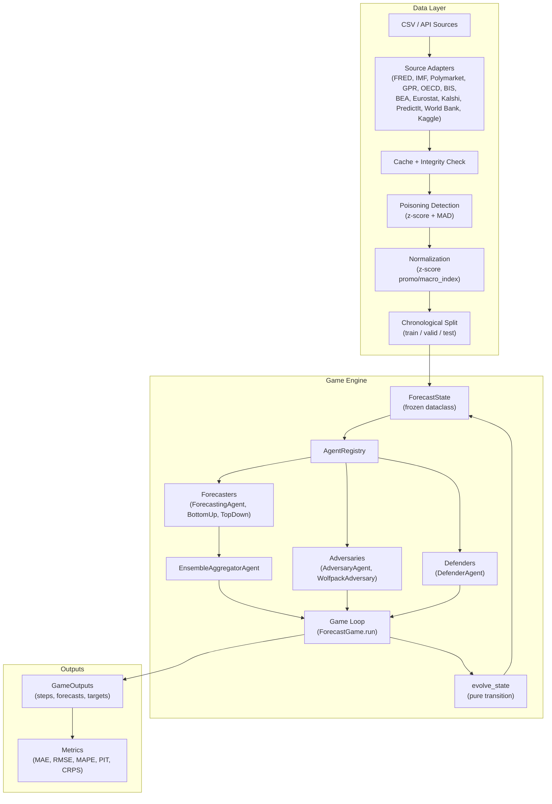
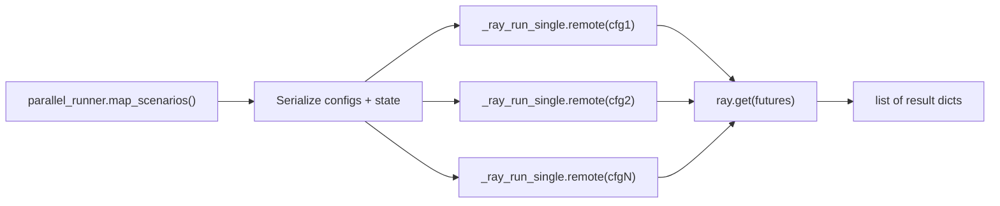
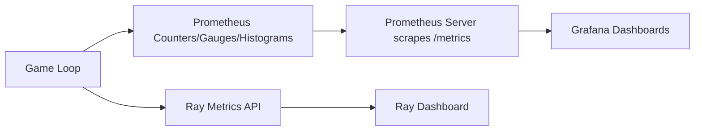

# Architecture

## Overview

The system models time-series forecasting as a multi-agent Markov game. At each round, a set of agents -- forecasters, adversaries, and defenders -- observe an immutable state, produce actions, and receive rewards. A pure transition function evolves the state deterministically given noise and disturbance inputs. This architecture enforces reproducibility by construction: identical seeds produce identical trajectories.

## Markov Game Formulation

The game is defined by the tuple **(S, A, T, R)**:

- **S** (`ForecastState`): the state space, represented as a frozen dataclass with fields `t`, `value`, `exogenous`, `hidden_shift`, `segment_id`, `segment_values`, and `macro_context`.
- **A** (`AgentAction`): the action space, where each agent produces a scalar `delta` applied to the forecast.
- **T** (`evolve_state`): the transition function, a pure function computing the next state from the current state, trend, noise, and disturbance.
- **R**: the reward function, where forecasters receive `-|error|` and adversaries receive `+|error|`.

## System Diagram


```mermaid
graph TB
    subgraph data ["Data Layer"]
        CSV["CSV / API Sources"]
        Adapters["Source Adapters<br/>(FRED, IMF, Polymarket, GPR, OECD, BIS,<br/>BEA, Eurostat, Kalshi, PredictIt, World Bank, Kaggle)"]
        Cache["Cache + Integrity Check"]
        Poison["Poisoning Detection<br/>(z-score + MAD)"]
        Norm["Normalization<br/>(z-score promo/macro_index)"]
        Split["Chronological Split<br/>(train / valid / test)"]
    end

    subgraph engine ["Game Engine"]
        State["ForecastState<br/>(frozen dataclass)"]
        Registry["AgentRegistry"]
        Forecasters["Forecasters<br/>(ForecastingAgent, BottomUp, TopDown)"]
        Adversaries["Adversaries<br/>(AdversaryAgent, WolfpackAdversary)"]
        Defenders["Defenders<br/>(DefenderAgent)"]
        Aggregator["EnsembleAggregatorAgent"]
        Loop["Game Loop<br/>(ForecastGame.run)"]
        Evolve["evolve_state<br/>(pure transition)"]
    end

    subgraph outputs ["Outputs"]
        GameOutputs["GameOutputs<br/>(steps, forecasts, targets)"]
        Metrics["Metrics<br/>(MAE, RMSE, MAPE, PIT, CRPS)"]
    end

    CSV --> Adapters --> Cache --> Poison --> Norm --> Split
    Split --> State
    State --> Registry
    Registry --> Forecasters & Adversaries & Defenders
    Forecasters --> Aggregator
    Aggregator --> Loop
    Adversaries --> Loop
    Defenders --> Loop
    Loop --> Evolve --> State
    Loop --> GameOutputs --> Metrics
```

## Pure-Functional Design

The framework enforces determinism through several mechanisms:

### Frozen Dataclasses

All state types are `@dataclass(frozen=True)`, making them immutable after construction. `ForecastState`, `SimulationConfig`, `AgentAction`, `StepResult`, and `TrajectoryEntry` cannot be mutated in place. State transitions create new instances via `dataclasses.replace()`.

### `evolve_state` Transition Function

The core transition is a pure function with explicit inputs:

```python
def evolve_state(
    state: ForecastState,
    *,
    base_trend: float,
    noise: float,
    disturbance: float,
    coeff_map: dict[str, float] | None = None,
) -> ForecastState:
```

The function computes:

```
new_value = value + base_trend + 0.4 * exogenous + noise + disturbance + macro_contribution
new_exogenous = 0.6 * exogenous + 0.2 * disturbance
hidden_shift = disturbance
```

When a `coeff_map` is provided, `macro_contribution` is the dot product of coefficient values with matching `macro_context` keys, enabling top-down macroeconomic influence on state evolution.

### `MappingProxyType` for Collection Fields

Mapping fields (`segment_values`, `macro_context`, `reward_breakdown`) use `types.MappingProxyType` via the `frozen_mapping()` helper. This makes them read-only at runtime, preventing accidental mutation of shared state across agents or rounds.

### Seeded RNG

Each `ForecastGame` instance receives an integer seed that initializes a `random.Random` instance. All stochastic operations (noise sampling, disturbance triggering) use this RNG, so identical seeds produce identical trajectories.

## Game Loop

The `ForecastGame.run()` method executes the simulation:


```mermaid
graph LR
    Init["Initial State"] --> ForLoop["for idx in range(n_rounds)"]
    ForLoop --> FA["Forecaster Actions<br/>(per agent in registry)"]
    FA --> Agg["Aggregate<br/>(EnsembleAggregatorAgent)"]
    Agg --> Adv["Adversary Actions"]
    Adv --> Def["Defender Actions"]
    Def --> Forecast["forecast = value + sum(deltas) + refactor_bias"]
    Forecast --> Evolve["evolve_state(noise, disturbance)"]
    Evolve --> Reward["reward = -|target - forecast|"]
    Reward --> Refactor["RefactoringAgent.revise(error)"]
    Refactor --> Log["Append StepResult + TrajectoryEntry"]
    Log --> ForLoop
    Log --> Outputs["GameOutputs"]
```

Each round:

1. All forecasters in the `AgentRegistry` produce `AgentAction` deltas.
2. If a `WolfpackAdversary` is present, it identifies the primary target (highest BMA weight agent) and coalition, then perturbs targeted forecasters' deltas individually before aggregation.
3. The `EnsembleAggregatorAgent` combines (possibly perturbed) deltas into a single forecast delta.
4. Standard adversary agents produce opposing deltas (when `disturbed=True`).
5. Defender agents produce corrective deltas using the configured defense model.
6. The forecast is computed: `state.value + f_delta + a_delta + d_delta + refactor_bias`.
7. `evolve_state` produces the next state with sampled noise and disturbance.
8. Per-agent forecast errors are computed and fed to the `BayesianAggregator` (Kelly-Criterion bankroll update) and any `WolfpackAdversary` (residual tracking).
9. Rewards are computed and distributed. The refactoring agent adjusts its bias.
10. `StepResult` and `TrajectoryEntry` are recorded.

The loop terminates when `n_rounds` is reached, `max_rounds` is hit, or a round exceeds `max_round_timeout_s`.

## Data Flow


```mermaid
graph LR
    API["External API<br/>(FRED, IMF, etc.)"] --> Adapter["SourceAdapter.fetch()"]
    Adapter --> RawRows["list[NormalizedRecord]"]
    RawRows --> CacheWrite["Cache to data/cache/"]
    CacheWrite --> Validate["Schema + Chronological Validation"]
    Validate --> Poison["detect_poisoning_rows()"]
    Poison --> Normalize["normalize_features()<br/>(z-score)"]
    Normalize --> Split["chronological_split()<br/>(70/15/15)"]
    Split --> Bundle["DatasetBundle<br/>(train, valid, test)"]
    Bundle --> GameInit["ForecastState from train[-1]"]
```

## Module Dependency Map

| Module | Depends On | Provides |
|---|---|---|
| `types.py` | (none) | `ForecastState`, `SimulationConfig`, `evolve_state` |
| `agents.py` | `types`, `defenses`, `llm`, `strategy_runtime` | 8 agent types, `AgentRegistry`, `SafeAgentExecutor` |
| `game.py` | `agents`, `aggregation`, `disturbances`, `observability`, `strategy_runtime`, `types` | `ForecastGame`, `GameOutputs` |
| `aggregation.py` | `types`, `metrics` | `BayesianAggregator` (Kelly-Criterion BMA) |
| `training.py` | `game`, `types` | `QTableAgent`, `WoLFPHCAgent`, `TrainingLoop`, `RADversarialTrainer` |
| `backtesting.py` | `game`, `metrics`, `types` | `WalkForwardBacktester`, `SensitivityAnalyzer` |
| `scenarios.py` | `game`, `types` | `ScenarioGenerator`, `ScenarioFan` |
| `distributed.py` | `game`, `types`, `observability` | `ParallelGameRunner`, `RayParallelGameRunner`, `FaultToleranceConfig`, `parallel_runner()` |
| `ray_actors.py` | `agents`, `strategy_runtime`, `types` | `RayForecasterActor`, `RayAdversaryActor`, `RayDefenderActor`, `ActorRegistry` |
| `rllib_env.py` | `disturbances`, `strategy_runtime`, `types` | `ForecastGameEnv`, `ForecastGameMultiAgentEnv` |
| `hyperopt.py` | `game`, `metrics`, `types` | `BayesianOptimizer` |
| `metrics.py` | (none) | MAE, RMSE, MAPE, PIT, CRPS, `neg_crps`, interval coverage |
| `disturbances.py` | `types` | 10 disturbance models, `disturbance_from_name` |
| `defenses.py` | (none) | 5 defense models, `defense_from_name` |
| `data.py` | `data_utils` | `DataProfile`, `DatasetBundle`, `load_dataset` |
| `verify.py` | `data`, `game`, `metrics`, `observability`, `types` | `run_verification()` |
| `validation_scenarios.py` | `data`, `game`, `metrics`, `types`, `data_utils` | 24 scenarios, `run_all_scenarios()` |
| `observability.py` | (none) | `GameObserver`, Prometheus counters/gauges/histograms, OpenTelemetry tracing, Ray metrics bridge |
| `strategy_runtime.py` | `types` | `PythonStrategyRuntime`, `PromptStrategyRuntime`, `ChatStrategyRuntime` |

## Distributed Execution

The framework supports parallel simulation execution via two backends, selected dynamically by the `parallel_runner()` factory:

```python
from framework.distributed import parallel_runner

runner = parallel_runner(backend="auto")  # Ray if available, else multiprocessing
results = runner.run_seeds(config, init_state, seeds=[1, 2, 3, 4], disturbed=True)
```

### Backend Selection

| Backend | Class | Requirements |
|---|---|---|
| `"auto"` | `RayParallelGameRunner` or `ParallelGameRunner` | Selects Ray when installed |
| `"ray"` | `RayParallelGameRunner` | `ray[default]>=2.9` |
| `"multiprocessing"` | `ParallelGameRunner` | stdlib only |

### Ray Task Fan-Out


```mermaid
graph LR
    Caller["parallel_runner.map_scenarios()"] --> Serialize["Serialize configs + state"]
    Serialize --> T1["_ray_run_single.remote(cfg1)"]
    Serialize --> T2["_ray_run_single.remote(cfg2)"]
    Serialize --> TN["_ray_run_single.remote(cfgN)"]
    T1 --> Collect["ray.get(futures)"]
    T2 --> Collect
    TN --> Collect
    Collect --> Results["list of result dicts"]
```

### Fault Tolerance

`FaultToleranceConfig` controls retry behavior for Ray tasks:

| Field | Default | Description |
|---|---|---|
| `max_task_retries` | 3 | Max retries per Ray task on transient failure |
| `retry_delay_s` | 1.0 | Delay between retries |
| `actor_max_restarts` | 3 | Max restarts for Ray actors on node loss |

## Observability Stack

The system provides comprehensive metrics, structured logging, and distributed tracing.

### Metrics Pipeline


```mermaid
graph LR
    GameLoop["Game Loop"] --> Prometheus["Prometheus Counters/Gauges/Histograms"]
    GameLoop --> RayMetrics["Ray Metrics API"]
    Prometheus --> Scrape["Prometheus Server scrapes /metrics"]
    RayMetrics --> Dashboard["Ray Dashboard"]
    Scrape --> Grafana["Grafana Dashboards"]
```

### Custom Metrics

| Metric Name | Type | Labels | Description |
|---|---|---|---|
| `marl_game_rounds_total` | Counter | -- | Total game rounds executed |
| `marl_game_round_latency_seconds` | Histogram | -- | Per-round execution latency |
| `marl_sim_mae` | Gauge | `seed`, `disturbed` | Simulation MAE |
| `marl_sim_rmse` | Gauge | `seed`, `disturbed` | Simulation RMSE |
| `marl_sim_mape` | Gauge | `seed`, `disturbed` | Simulation MAPE |
| `marl_sim_worst_case` | Gauge | `seed`, `disturbed` | Worst-case absolute error |
| `marl_sim_duration_seconds` | Histogram | -- | Simulation wall-clock time |
| `marl_sim_rounds` | Gauge | `seed` | Rounds executed |
| `marl_agent_delta` | Histogram | `actor`, `role` | Agent delta per round |
| `marl_agent_reward_total` | Counter | `actor` | Cumulative agent reward |
| `marl_disturbance_injections_total` | Counter | -- | Disturbance injection count |
| `marl_disturbance_success_total` | Counter | -- | Disturbances that increased error |
| `marl_alert_anomaly_total` | Counter | `alert_type` | Alert threshold breaches |

### Ray Metrics Bridge

`register_ray_metrics()` creates Ray-native mirrors of Prometheus metrics using `ray.util.metrics`. Recording helpers dual-emit to both Prometheus and Ray when both are available.

### Structured Logging

When `structlog` is installed, `GameObserver.logger()` returns a bound logger with JSON output. The processor chain includes `add_log_level`, `TimeStamper(fmt="iso")`, and `JSONRenderer`. Loggers are bound with `simulation_seed` and `round_idx` for correlation.

### OpenTelemetry Tracing

When `opentelemetry-sdk` is installed, the game loop emits spans:

- `simulation.run`: wraps the full `ForecastGame.run()` invocation with attributes `seed`, `disturbed`, `n_rounds`.
- `simulation.round`: child span per round with `round_idx`.

Trace context is propagated across Ray tasks via serialized carrier dicts, linking parallel simulations to the parent trace.

## Explainability UI

An interactive Streamlit application (`ui/app.py`) provides six pages:

| Page | Purpose |
|---|---|
| Simulation Replay | Step-through visualization of game rounds with forecast vs target charts |
| Agent Contributions | Per-agent delta/reward analysis with correlation heatmap |
| Metric Decomposition | Clean vs attacked comparison, error attribution waterfall |
| What-If | Interactive parameter tweaking with on-demand re-simulation |
| Data Lineage | Data pipeline visualization, split boundaries, cache status |
| LLM Inspection | Placeholder for prompt history and rationale logs |

All UI pages read immutable JSON artifacts without mutating system state.
