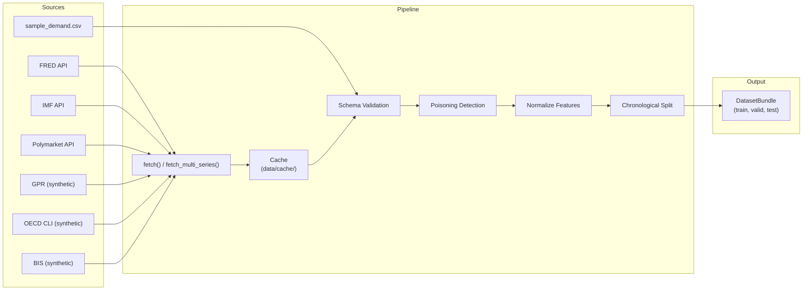

# Data Pipeline

## Overview

The data pipeline ingests time-series records from multiple sources, validates and caches them, detects potential poisoning, normalizes features, and splits chronologically into train/valid/test bundles. All records conform to a common `NormalizedRecord` schema with provenance tracking.

## Source Adapters

| Adapter | Class | Source | Status | Series |
|---|---|---|---|---|
| FRED | `FredMacroAdapter` | US Federal Reserve Economic Data | Live API | CPI, GDP, UNRATE, FEDFUNDS, T10YIE |
| IMF | `IMFWorldEconomicAdapter` | International Monetary Fund | Live API | GDP growth projections |
| Polymarket | `PolymarketAdapter` | Polymarket prediction markets | Live API | Event probability |
| GPR | `GeopoliticalRiskAdapter` | Geopolitical Risk Index | Synthetic proxy | GPR index |
| OECD CLI | `OECDCLIAdapter` | OECD Composite Leading Indicators | Synthetic proxy | CLI composite |
| BIS | `BISPolicyRateAdapter` | Bank for International Settlements | Synthetic proxy | Policy rate |

All adapters implement the `SourceAdapter` protocol with a `fetch(periods: int) -> list[NormalizedRecord]` method.

## NormalizedRecord Schema

```python
@dataclass(frozen=True)
class NormalizedRecord:
    timestamp: datetime
    series_id: str
    target: float
    promo: float
    macro_index: float
    source: str
    fetched_at: datetime
```

Every record retains `source` and `fetched_at` for auditability. The schema is validated by `validate_source_schema()` during ingestion.

## FRED Multi-Series Integration

The `FredMacroAdapter.fetch_multi_series()` method downloads five FRED series simultaneously:

| Series ID | Description | Role in `macro_context` |
|---|---|---|
| `CPIAUCSL` | Consumer Price Index for All Urban Consumers | Primary target; inflation proxy |
| `GDP` | Gross Domestic Product | Growth indicator |
| `UNRATE` | Unemployment Rate | Labor market signal |
| `FEDFUNDS` | Federal Funds Rate | Monetary policy |
| `T10YIE` | 10-Year Breakeven Inflation Rate | Inflation expectations |

### `FRED_API_KEY` Usage

| Component | Behavior with Key | Behavior without Key |
|---|---|---|
| `FredMacroAdapter.fetch()` | Downloads from `api.stlouisfed.org` | Returns synthetic CPI proxy |
| `FredMacroAdapter.fetch_multi_series()` | Downloads all 5 series, merges by date | Returns `_synthetic_multi()` |
| `build_fred_training_set()` | Fetches + caches multi-series data | Uses synthetic proxy |
| `scripts/run_training.py` | Trains on real FRED data | Falls back to synthetic |
| `scripts/run_backtest.py` | Backtests on real FRED data | Falls back to synthetic |
| `fred_training_backtest` scenario | Runs walk-forward validation | Skips with `passed=True` |

### Multi-Series Merge Flow

1. Each series is fetched independently via `_fetch_series(sid, key, periods)`.
2. Observations are indexed by date string into a shared dictionary.
3. Missing values are forward-filled using the last known value per series.
4. Each output row contains `timestamp`, `target` (from CPIAUCSL), standard schema fields, and a `macro_context` dict mapping all 5 series to their values at that date.

## Caching Architecture

Fetched data is cached under `data/cache/` using the `ensure_source_data()` utility:

1. **Cache key**: `{source}_{periods}.json` in the cache directory.
2. **Integrity validation**: `validate_cache_integrity()` checks file existence, JSON parsability, and record count.
3. **Freshness**: Cached data is reused unless `force_redownload=True` is specified.
4. **Checksum**: SHA-256 checksums are stored alongside cached data for tamper detection.

The `build_fred_training_set()` function provides an additional caching layer specific to multi-series FRED data, producing a combined `DatasetBundle` from the merged rows.

## Poisoning Detection

The `detect_poisoning_rows()` function identifies statistically anomalous records using two independent tests:

1. **Z-score test**: Flags rows where `|target - mean| / std >= z_threshold` (default 6.0).
2. **Modified z-score (MAD) test**: Flags rows where `0.6745 * |target - median| / MAD >= mad_threshold` (default 8.0).

A row is flagged if either test triggers. The `should_reject_poisoning()` function determines whether the contamination level warrants rejection (requires >= 2 suspects and >= 2% of total rows).

When `DataProfile.fail_on_poisoning=True`, `load_dataset()` raises a `ValueError` if rejection criteria are met.

## Normalization

The `normalize_features()` function applies z-score normalization to `promo` and `macro_index` columns:

```
z = (x - mean) / std
```

This is applied before splitting to prevent scale differences across sources from biasing agent behavior. The `target` column is left unnormalized to preserve interpretability.

## Chronological Splitting

The `chronological_split()` function divides records temporally:

```
train: rows[0 : n * train_ratio]
valid: rows[n * train_ratio : n * (train_ratio + valid_ratio)]
test:  rows[n * (train_ratio + valid_ratio) :]
```

Default ratios are 70/15/15. The split is strictly chronological -- no shuffling -- to prevent future data leakage. Records are pre-sorted by `(series_id, timestamp)` during loading.

Validation via `validate_no_future_leakage()` confirms that the maximum timestamp in each split precedes the minimum timestamp of the next split.

## DataProfile Configuration

The `DataProfile` dataclass configures the data loading pipeline:

| Field | Type | Default | Description |
|---|---|---|---|
| `source` | str | `"sample_csv"` | Data source identifier |
| `periods` | int | 240 | Number of periods to load |
| `train_ratio` | float | 0.7 | Fraction of data for training |
| `valid_ratio` | float | 0.15 | Fraction for validation |
| `normalize` | bool | True | Apply z-score normalization |
| `realtime_refresh` | bool | False | Update latest record timestamp |
| `hybrid_weight` | float | 0.5 | Weight for real data in hybrid mode |
| `fail_on_poisoning` | bool | False | Raise on detected poisoning |

Valid `source` values: `sample_csv`, `fred`, `imf`, `polymarket`, `hybrid`, `fred_training`.

## Hybrid Mode

When `source="hybrid"`, the pipeline blends real FRED data with synthetic data:

1. Loads synthetic data via `build_sample_dataset()`.
2. Loads FRED data via `load_source_rows("fred")`.
3. Merges using `build_hybrid_rows(real, synthetic, real_weight=hybrid_weight)`.
4. Takes `real_weight` fraction from real data and the remainder from synthetic.
5. Result is sorted chronologically and processed normally.

## Pipeline Diagram


