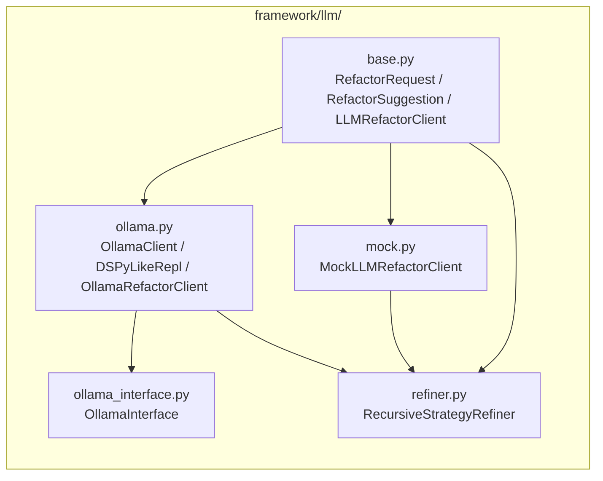

# LLM Integration

## Overview

The framework integrates with local LLM inference via Ollama for two purposes: interactive strategy exploration through a REPL-style interface, and automated recursive strategy refinement from trajectory analysis. All LLM-dependent code fails gracefully to deterministic mock implementations when Ollama is unavailable.

## Architecture



## OllamaClient

Low-level client for the Ollama REST API:

```python
@dataclass(frozen=True)
class OllamaClient:
    base_url: str = os.getenv("OLLAMA_BASE_URL", "http://localhost:11434")
    model: str = "llama3.2"
    keep_alive: str = "5m"
```

### Methods

| Method | Endpoint | Returns |
|---|---|---|
| `generate(prompt)` | `POST /api/generate` | Completion string |
| `embeddings(text)` | `POST /api/embeddings` | List of floats |

Both methods use `stream=False` for synchronous responses with a 10-second timeout.

### Environment Variable

Set `OLLAMA_BASE_URL` to point to a non-default Ollama instance:

```bash
export OLLAMA_BASE_URL=http://my-gpu-server:11434
```

## DSPyLikeRepl

A REPL-style interface that combines generation and embedding in a single turn:

```python
@dataclass(frozen=True)
class DSPyLikeRepl:
    client: OllamaClient
```

### `run_turn(prompt)`

1. Generates a completion from the prompt.
2. Embeds the first 256 characters of the completion.
3. Returns a dict with `prompt`, `completion`, `embedding_size`, `model`, and `keep_alive`.

Used by `ForecastingAgent` when an `llm_repl` is provided, blending the LLM-suggested delta with the runtime delta at an 80/20 ratio.

## OllamaRefactorClient

Implements the `LLMRefactorClient` protocol using Ollama's generate API:

```python
@dataclass(frozen=True)
class OllamaRefactorClient:
    client: OllamaClient = OllamaClient()
    _fallback: MockLLMRefactorClient = MockLLMRefactorClient()
```

### `suggest(request)`

1. Constructs a prompt asking for a JSON response: `{"bias_adjustment": <float>, "rationale": "<string>"}`.
2. Calls `OllamaClient.generate()`.
3. Parses the JSON response to extract `bias_adjustment` and `rationale`.
4. On any error (network, parse, timeout), falls back to `MockLLMRefactorClient.suggest()`.

## OllamaInterface

A more complete Ollama API wrapper with additional endpoints:

```python
@dataclass(frozen=True)
class OllamaInterface:
    base_url: str = os.getenv("OLLAMA_BASE_URL", "http://localhost:11434")
    model: str = "llama3.2"
    keep_alive: str = "5m"
```

### Methods

| Method | Endpoint | Description |
|---|---|---|
| `chat(messages)` | `POST /api/chat` | Multi-turn conversation |
| `generate(prompt)` | `POST /api/generate` | Single-turn generation |
| `embeddings(text)` | `POST /api/embeddings` | Text embeddings |
| `list_models()` | `GET /api/tags` | List available models |
| `keep_alive_ping()` | `POST /api/generate` | Keep model loaded |
| `is_available()` | `GET /api/tags` | Check server connectivity |

## MockLLMRefactorClient

Deterministic mock for testing without Ollama:

```python
@dataclass(frozen=True)
class MockLLMRefactorClient:
    step_size: float = 0.02
```

### `suggest(request)`

Returns a fixed `RefactorSuggestion`:
- `bias_adjustment = -step_size` if `latest_error > 0`, else `+step_size`.
- `rationale = "deterministic mock adjustment for {strategy_name}"`.

This ensures all tests and CI runs produce deterministic, reproducible results without requiring a running Ollama server.

## RecursiveStrategyRefiner

Analyzes game trajectories and generates LLM-driven strategy adjustments:

```python
@dataclass(frozen=True)
class RecursiveStrategyRefiner:
    client: OllamaRefactorClient | MockLLMRefactorClient = MockLLMRefactorClient()
    clamp_min: float = -0.1
    clamp_max: float = 0.1
```

### `refine(trajectories)`

1. **Summarize trajectories**: Extracts per-round forecaster rewards and absolute errors.
2. **Compute statistics**: Mean reward, worst error, mean error.
3. **Request suggestion**: Passes `mean_error` as `latest_error` to the client's `suggest()` method.
4. **Clamp output**: The returned `bias_adjustment` is clamped to `[clamp_min, clamp_max]` (default `[-0.1, 0.1]`).

### Result

```python
@dataclass(frozen=True)
class RefinementResult:
    bias_adjustment: float    # clamped adjustment
    strategy_hint: str        # rationale from LLM/mock
    raw_response: str         # diagnostic string with mean_reward and worst_error
```

### Safety Bounds

The clamp bounds prevent the LLM from suggesting excessively large adjustments that could destabilize the forecast. Even if the LLM suggests a bias of 5.0, it will be clamped to 0.1.

## Protocol Hierarchy

```python
class LLMRefactorClient(Protocol):
    def suggest(self, request: RefactorRequest) -> RefactorSuggestion: ...
```

Both `OllamaRefactorClient` and `MockLLMRefactorClient` implement this protocol. The `RefactoringAgent` and `RecursiveStrategyRefiner` accept either implementation, enabling seamless switching between real and mock LLM backends.

## Usage in the Game Loop

The refactoring agent is called at the end of each round in `ForecastGame.run()`:

```python
if config.enable_refactor and refactor is not None:
    refactor_bias += refactor.revise(error, use_llm=config.enable_llm_refactor)
```

The cumulative `refactor_bias` is added to every subsequent forecast. When `enable_llm_refactor=True`, the agent delegates to its `llm_client` (which defaults to `MockLLMRefactorClient`).

For post-game refinement, the `RecursiveStrategyRefiner` processes the full `TrajectoryEntry` list and produces a single aggregate adjustment.
