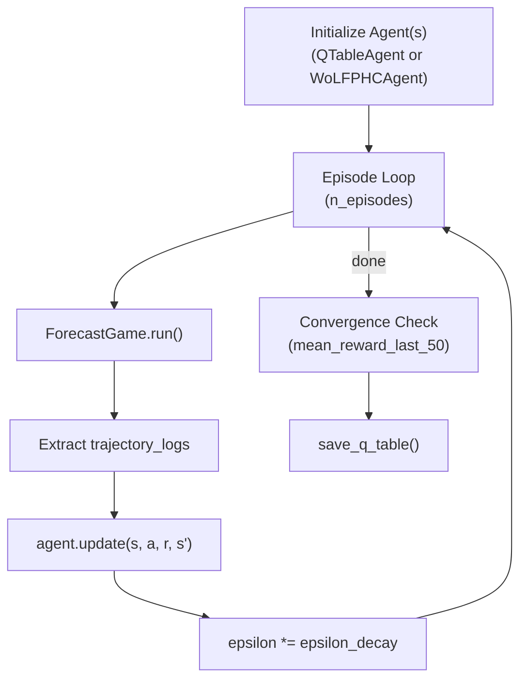

# MARL Training

## Overview

The framework supports training learnable agents using three multi-agent reinforcement learning algorithms: tabular Q-learning, WoLF-PHC (Win or Learn Fast - Policy Hill Climbing), and Robust Adversarial RL (RARL). All algorithms operate over discretized action spaces and use the game engine for episode generation.

## DiscreteActionSpace

Continuous agent deltas are discretized into bins for tabular methods:

```python
@dataclass(frozen=True)
class DiscreteActionSpace:
    n_bins: int = 21
    max_delta: float = 1.0
```

The range `[-max_delta, max_delta]` is divided into `n_bins` evenly spaced actions.

| Property | Formula |
|---|---|
| `bin_width` | `2 * max_delta / (n_bins - 1)` |
| `action_to_delta(idx)` | `-max_delta + idx * bin_width` |
| `delta_to_action(delta)` | Nearest bin index for clamped delta |

With defaults, 21 bins span [-1.0, 1.0] in steps of 0.1.

## State Hashing

Q-tables use a hash function to discretize continuous states into buckets:

```python
def _state_hash(state: ForecastState, n_buckets: int = 50) -> int:
    v_bucket = int((state.value % 100) / 2) % n_buckets
    e_bucket = int((state.exogenous + 5) * 5) % n_buckets
    return v_bucket * n_buckets + e_bucket
```

This produces up to 2500 unique state keys (50 x 50), providing a coarse-grained state representation suitable for tabular methods.

## QTableAgent (Q-Learning)

A standard tabular Q-learning agent with epsilon-greedy exploration:

| Parameter | Default | Description |
|---|---|---|
| `alpha` | 0.1 | Learning rate |
| `gamma` | 0.95 | Discount factor |
| `epsilon` | 1.0 | Initial exploration probability |
| `epsilon_decay` | 0.995 | Per-step decay multiplier |
| `epsilon_min` | 0.05 | Minimum exploration probability |

### Action Selection

```
if random() < epsilon:
    return random action
else:
    return argmax Q(s, a)
```

### Update Rule

```
TD_error = reward + gamma * max(Q(s', a')) - Q(s, a)
Q(s, a) += alpha * TD_error
epsilon = max(epsilon_min, epsilon * epsilon_decay)
```

### Q-Table Serialization

Q-tables can be saved and loaded as JSON:

```python
TrainingLoop.save_q_table(agent, "data/models/forecaster_q.json")
agent = TrainingLoop.load_q_table("data/models/forecaster_q.json")
```

The serialized format includes the Q-table entries, current epsilon, and action space parameters.

## WoLFPHCAgent (WoLF-PHC)

Extends `QTableAgent` with a mixed-strategy policy that converges toward Nash equilibrium. Based on Bowling & Veloso (2002).

| Parameter | Default | Description |
|---|---|---|
| `delta_win` | 0.01 | Policy update rate when winning |
| `delta_lose` | 0.04 | Policy update rate when losing |

### Key Mechanism

WoLF-PHC maintains two policies per state:

- **Current policy** (`pi`): the actual action selection distribution.
- **Average policy** (`avg_pi`): a running average of past policies (weighted by visit count).

The agent determines whether it is "winning" or "losing" by comparing the expected Q-value under the current policy vs. the average policy:

```
if E_pi[Q(s)] >= E_avg[Q(s)]:
    delta = delta_win    (small updates when winning)
else:
    delta = delta_lose   (large updates when losing)
```

This asymmetric learning rate causes losing agents to adapt faster, promoting convergence to equilibrium.

### Policy Update

After each Q-table update:

1. Identify the greedy action: `best_action = argmax Q(s, a)`.
2. Increase `pi[best_action]` by `delta`, decrease all others by `delta / (n - 1)`.
3. Clamp values to [0, 1] and renormalize.

### Action Selection

Uses weighted random sampling from the current policy `pi(s)`, with epsilon-greedy exploration.

## TrainingLoop

Orchestrates multi-episode training:

```python
@dataclass
class TrainingLoop:
    config: SimulationConfig
    n_episodes: int = 500
    seed: int = 42
```

### Episode Structure

For each episode:

1. Create a new `ForecastGame` with seed `self.seed + episode_idx`.
2. Run the game to generate trajectory logs.
3. For each logged transition `(state, action, reward, next_state)`:
   - The forecaster agent selects and updates its action.
   - If an adversary agent is provided, it also selects and updates (with negated reward).
4. Track per-episode mean reward and TD error magnitude.

### Return Value

```python
{
    "n_episodes": 500,
    "final_epsilon": 0.08,
    "mean_reward_last_50": -0.42,
    "mean_td_error_last_100": 0.15,
    "rewards_history": [...]
}
```

## RADversarialTrainer (Robust Adversarial RL)

Implements alternating training between forecaster and adversary for minimax robustness:

```python
@dataclass
class RADversarialTrainer:
    config: SimulationConfig
    alternation_schedule: int = 10
    total_epochs: int = 100
    seed: int = 42
```

### Alternation Schedule

Training alternates between the forecaster and adversary every `alternation_schedule` epochs:

```
Epochs 0-9:   Train forecaster (freeze adversary)
Epochs 10-19: Train adversary (freeze forecaster)
Epochs 20-29: Train forecaster
...
```

This produces a minimax equilibrium where the forecaster learns to be robust against the strongest adversary, and the adversary learns to exploit the current forecaster.

### Return Value

```python
{
    "total_epochs": 100,
    "alternation_schedule": 10,
    "epoch_results": [
        {"epoch": 0, "training": "forecaster", "mean_reward": -0.5},
        ...
    ]
}
```

## IterativeFeedbackLoop

Updates agent weights from realized outcomes during backtesting:

```python
@dataclass
class IterativeFeedbackLoop:
    def update_from_realized(
        self,
        agent: QTableAgent,
        realized_pairs: list[tuple[ForecastState, float, float]],
    ) -> dict[str, Any]:
```

Each pair is `(state, forecast, realized_value)`. The method computes the realized reward as `-|realized - forecast|` and updates the agent's Q-table, enabling online adaptation from ground truth data.

## CLI Reference

### `scripts/run_training.py`

```bash
python scripts/run_training.py [OPTIONS]

Options:
  --algorithm {q,wolf,rarl}   Algorithm to use (default: wolf)
  --episodes N                Number of training episodes (default: 200)
  --horizon N                 Rounds per episode (default: 80)
  --source {fred,synthetic}   Data source (default: fred if FRED_API_KEY set)
  --output PATH               Q-table output path
```

### `scripts/run_backtest.py`

```bash
python scripts/run_backtest.py [OPTIONS]

Options:
  --windows N                 Maximum number of walk-forward windows
  --window-size N             Training window size in rows
  --step-size N               Step between windows
```

## Training Loop Diagram


