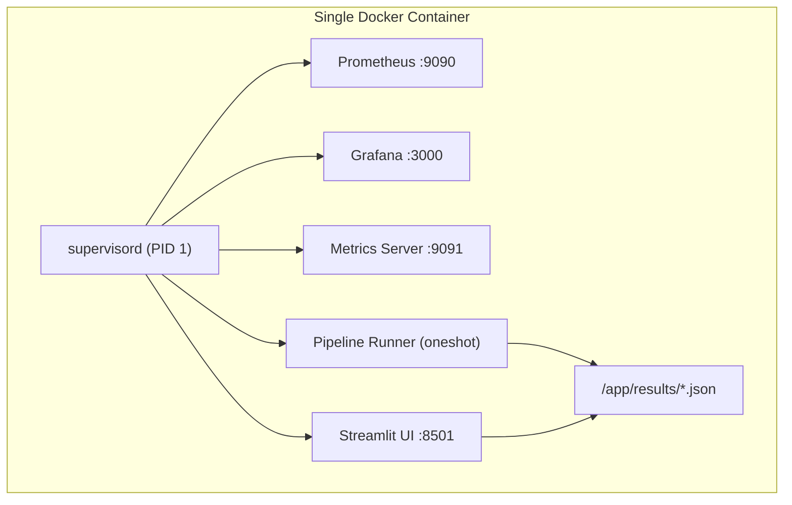
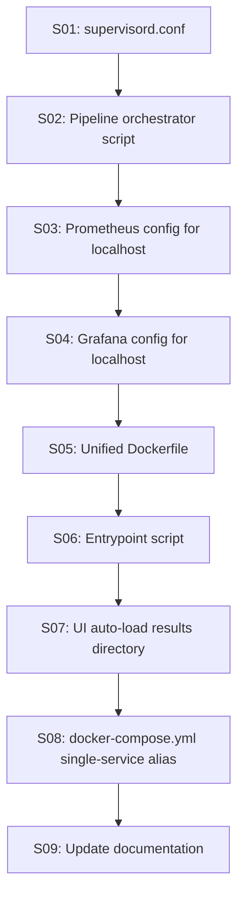

# Single-Container Supervisord Dockerization

## Problem

The current setup requires `docker compose up` with 6 separate containers (ray-head, ray-worker, prometheus, grafana, app, streamlit). The user wants a single `docker run` command that:

1. Starts all infrastructure services (Prometheus, Grafana, metrics server)
2. Executes **all** existing code: tests, verification, training, backtesting, validation scenarios, stress tests
3. Exports execution artifacts (trajectory JSON, reports) to a location the Streamlit UI can find
4. Keeps the Streamlit UI running so the user can review results at leisure

## Architecture



Exposed ports: **8501** (Streamlit UI), **3000** (Grafana), **9090** (Prometheus), **9091** (app metrics).

Ray is not included inside the single container (it would require a multi-node cluster to be useful). The parallel runner falls back to `multiprocessing`, which works correctly in-container.

## Dependency Graph



---

## S01: Create `infra/supervisord.conf`

New file: [infra/supervisord.conf](infra/supervisord.conf)

Defines 4 managed programs:

- **prometheus** -- `/usr/bin/prometheus --config.file=/etc/prometheus/prometheus.yml --storage.tsdb.path=/tmp/prometheus --web.listen-address=:9090`. Priority 10 (starts first). `autorestart=true`.
- **grafana** -- `/usr/share/grafana/bin/grafana server --homepath=/usr/share/grafana --config=/etc/grafana/grafana.ini`. Priority 20. `autorestart=true`.
- **metrics_server** -- `python -c "from framework.observability import start_metrics_server; start_metrics_server(9091); import time; time.sleep(999999)"`. Priority 30. `autorestart=true`.
- **pipeline** -- `/app/scripts/run_all_pipeline.sh`. Priority 40. `autorestart=false`, `startsecs=0`, `exitcodes=0,1`. This is the one-shot execution that runs everything and exits.
- **streamlit** -- `streamlit run ui/app.py --server.port=8501 --server.address=0.0.0.0 --server.headless=true`. Priority 50. `autorestart=true`.

All programs log to `/app/logs/` via `stdout_logfile`.

Top-level supervisord config: `nodaemon=true` (keeps container alive), `user=root`.

---

## S02: Create pipeline orchestrator script

New file: [scripts/run_all_pipeline.sh](scripts/run_all_pipeline.sh)

This is the one-shot script that executes everything sequentially and writes all outputs to `/app/results/`:

```bash
#!/usr/bin/env bash
set -uo pipefail
RESULTS=/app/results
mkdir -p "$RESULTS"

echo "[pipeline] === Phase 1: Unit + Property Tests ==="
python -m pytest -q --tb=short 2>&1 | tee "$RESULTS/pytest_output.txt"
PYTEST_EXIT=$?

echo "[pipeline] === Phase 2: Verification ==="
python scripts/run_verification.py --backend multiprocessing 2>&1 | tee "$RESULTS/verification_output.txt"
cp planning/verification_report.json "$RESULTS/" 2>/dev/null || true

echo "[pipeline] === Phase 3: Training (smoke) ==="
python scripts/run_training.py --episodes 20 --horizon 30 2>&1 | tee "$RESULTS/training_output.txt"

echo "[pipeline] === Phase 4: Backtest ==="
python scripts/run_backtest.py --windows 5 --window-size 40 --step-size 15 --output-dir "$RESULTS" 2>&1 | tee "$RESULTS/backtest_output.txt"

echo "[pipeline] === Phase 5: Validation Scenarios ==="
python scripts/run_validation_scenarios.py --scenarios all --output-dir "$RESULTS" 2>&1 | tee "$RESULTS/validation_output.txt"

echo "[pipeline] === Phase 6: Stress Test ==="
python scripts/run_stress_test.py --games 20 --rounds 200 --workers 2 2>&1 | tee "$RESULTS/stress_output.txt"

echo "[pipeline] === Phase 7: Export Trajectory Artifacts ==="
python -c "
import json
from framework.game import ForecastGame
from framework.distributed import _game_outputs_to_dict
from framework.types import ForecastState, SimulationConfig

results_dir = '/app/results'
cfg = SimulationConfig(horizon=100, max_rounds=200, disturbance_prob=0.2, disturbance_scale=1.2, defense_model='ensemble')
state = ForecastState(t=0, value=10.0, exogenous=0.0, hidden_shift=0.0)

for label, disturbed, seed in [('clean', False, 42), ('attacked', True, 42), ('attacked_s99', True, 99)]:
    out = ForecastGame(cfg, seed=seed).run(state, disturbed=disturbed)
    d = _game_outputs_to_dict(out)
    d['seed'] = seed
    d['label'] = label
    path = f'{results_dir}/simulation_{label}.json'
    with open(path, 'w') as f:
        json.dump(d, f, indent=2)
    print(f'[pipeline] Wrote {path}')
" 2>&1 | tee "$RESULTS/export_output.txt"

echo "[pipeline] === Pipeline Complete (pytest exit=$PYTEST_EXIT) ==="
echo "$PYTEST_EXIT" > "$RESULTS/.pipeline_exit_code"
```

All reports, trajectory JSONs, and console logs land in `/app/results/` for the UI to discover.

---

## S03: Localhost Prometheus configuration

New file: [infra/prometheus-standalone.yml](infra/prometheus-standalone.yml)

Identical to existing [infra/prometheus.yml](infra/prometheus.yml) but with targets rewritten for `localhost`:

```yaml
global:
  scrape_interval: 15s
  evaluation_interval: 15s

scrape_configs:
  - job_name: "marl_app"
    static_configs:
      - targets: ["localhost:9091"]

rule_files:
  - "/etc/prometheus/alert_rules.yml"
```

The Ray scrape job is removed since Ray is not running inside the single container.

---

## S04: Grafana standalone provisioning

New file: [infra/grafana-standalone/provisioning/datasources/prometheus.yml](infra/grafana-standalone/provisioning/datasources/prometheus.yml)

Same as existing but with `url: http://localhost:9090` instead of `http://prometheus:9090`.

Dashboards provisioning and JSON files are reused as-is from the existing `infra/grafana/` directory -- they reference Prometheus queries that work regardless of hostname.

---

## S05: Unified Dockerfile

Replace [Dockerfile](Dockerfile) with a new multi-stage build that produces an all-in-one image:

**Stage 1** (`haskell-build`): Unchanged -- compiles the Haskell binary.

**Stage 2** (`base`): Unchanged -- installs Python deps, copies app code.

**Stage 3** (`streamlit`): Unchanged -- inherits from `base`, sets Streamlit CMD (for docker-compose use).

**Stage 4** (`allinone`): New stage inheriting from `base`:

```dockerfile
FROM base AS allinone

RUN apt-get update && apt-get install -y --no-install-recommends \
    supervisor \
    wget \
    adduser \
    libfontconfig1 \
    && rm -rf /var/lib/apt/lists/*

# Install Prometheus
RUN wget -qO- https://github.com/prometheus/prometheus/releases/download/v2.51.0/prometheus-2.51.0.linux-amd64.tar.gz \
    | tar xz --strip-components=1 -C /usr/local/bin/ prometheus-2.51.0.linux-amd64/prometheus prometheus-2.51.0.linux-amd64/promtool

# Install Grafana
RUN wget -qO /tmp/grafana.deb https://dl.grafana.com/oss/release/grafana_10.4.1_amd64.deb \
    && dpkg -i /tmp/grafana.deb \
    && rm /tmp/grafana.deb

# Prometheus config
COPY infra/prometheus-standalone.yml /etc/prometheus/prometheus.yml
COPY infra/alert_rules.yml /etc/prometheus/alert_rules.yml

# Grafana provisioning (using standalone datasource)
COPY infra/grafana-standalone/provisioning /etc/grafana/provisioning
COPY infra/grafana/dashboards /var/lib/grafana/dashboards

# Grafana anonymous access
RUN sed -i 's/;allow_embedding.*/allow_embedding = true/' /etc/grafana/grafana.ini || true
ENV GF_SECURITY_ADMIN_PASSWORD=admin
ENV GF_AUTH_ANONYMOUS_ENABLED=true
ENV GF_AUTH_ANONYMOUS_ORG_ROLE=Viewer

# Supervisord config
COPY infra/supervisord.conf /etc/supervisor/conf.d/supervisord.conf

# Pipeline script
COPY scripts/run_all_pipeline.sh /app/scripts/run_all_pipeline.sh
RUN chmod +x /app/scripts/run_all_pipeline.sh

# Results volume
RUN mkdir -p /app/results /app/logs

EXPOSE 8501 3000 9090 9091

CMD ["supervisord", "-c", "/etc/supervisor/conf.d/supervisord.conf"]
```

The `base` and `streamlit` stages remain untouched so the existing `docker-compose.yml` multi-service flow still works.

---

## S06: Entrypoint documentation in the Dockerfile

No separate entrypoint script needed -- `supervisord` is the CMD. The user runs:

```bash
docker build --target allinone -t marl-forecast-game:allinone .
docker run --rm -p 8501:8501 -p 3000:3000 -p 9090:9090 -p 9091:9091 marl-forecast-game:allinone
```

On startup, supervisord launches all 5 programs in priority order. The pipeline runs to completion while Prometheus, Grafana, metrics server, and Streamlit stay alive. The container remains running (Streamlit + Grafana keep it alive) until the user kills it.

---

## S07: UI auto-load from `/app/results/`

File: [ui/utils.py](ui/utils.py)

Add a function `discover_result_files(results_dir="/app/results") -> list[Path]` that scans for `*.json` files, returning them sorted by modification time.

Files: [ui/pages/replay.py](ui/pages/replay.py), [ui/pages/agents.py](ui/pages/agents.py), [ui/pages/metrics.py](ui/pages/metrics.py)

On each page, before the file-upload widget, add a selectbox populated by `discover_result_files()`. If running inside the container (results directory exists and is non-empty), the user can pick from pre-generated simulation outputs without needing to upload anything. The file-upload fallback remains for local/external use.

File: [ui/pages/whatif.py](ui/pages/whatif.py)

After running a what-if simulation, auto-save the result to `/app/results/whatif_{timestamp}.json` so it appears in other pages.

---

## S08: Update `docker-compose.yml` with single-service alias

File: [docker-compose.yml](docker-compose.yml)

Add a new service `allinone` alongside the existing multi-service definitions:

```yaml
  allinone:
    build:
      context: .
      dockerfile: Dockerfile
      target: allinone
    container_name: marl-allinone
    ports:
      - "8501:8501"
      - "3000:3000"
      - "9090:9090"
      - "9091:9091"
    volumes:
      - ./results:/app/results
```

The `volumes` mount lets the user access all reports and trajectory files on the host after the run. Existing services are preserved.

---

## S09: Update documentation

File: [docs/deployment.md](docs/deployment.md)

Add a new "All-in-One Container" section before the existing "Docker Compose Stack" section:

- Document the single-command launch: `docker build --target allinone -t marl:allinone . && docker run --rm -p 8501:8501 -p 3000:3000 marl:allinone`
- Document the service mapping (port -> service) table
- Document that the pipeline runs automatically on startup; tail logs via `docker logs -f <container>`
- Document that results are available in `/app/results/` inside the container (or mount with `-v ./results:/app/results`)
- Document the supervisord log locations: `/app/logs/{program}.log`
- Note that the multi-service docker-compose flow is still available for production/cluster use

File: [README.md](README.md)

Add a "Quick Start (Single Container)" section near the top with the one-liner docker command and the port table.
